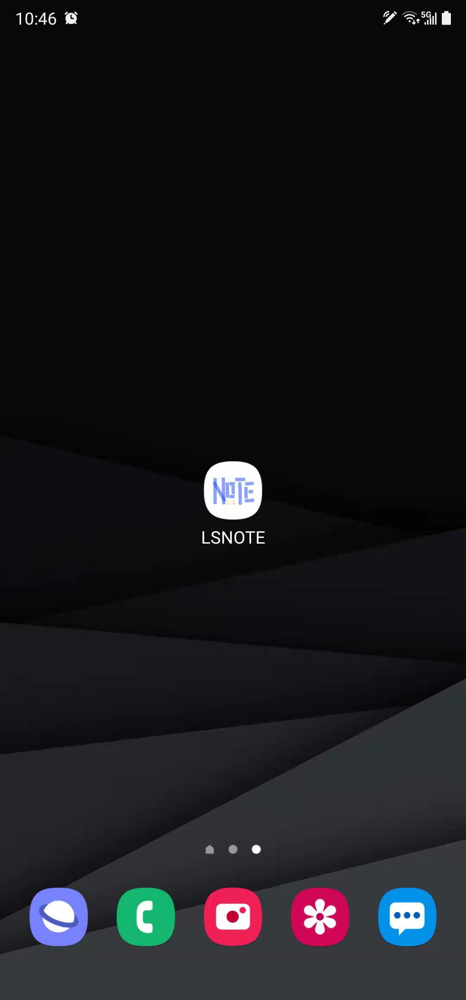
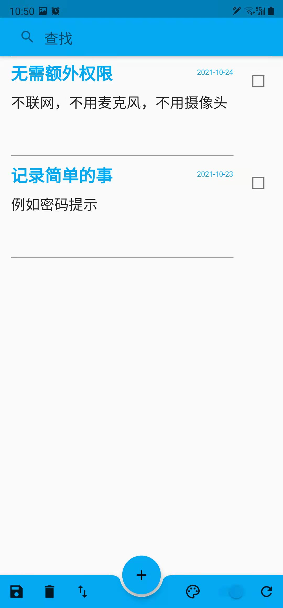
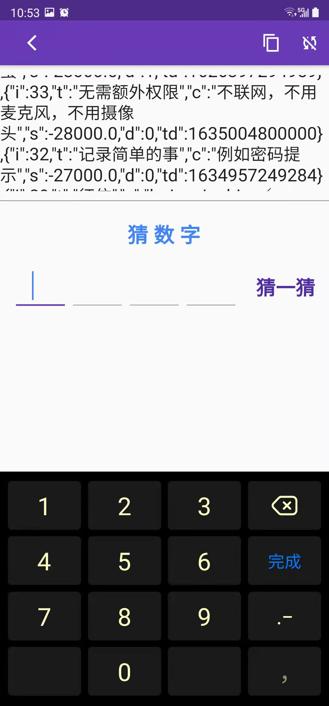
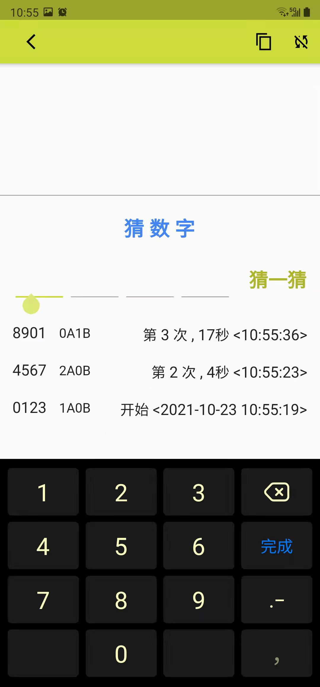
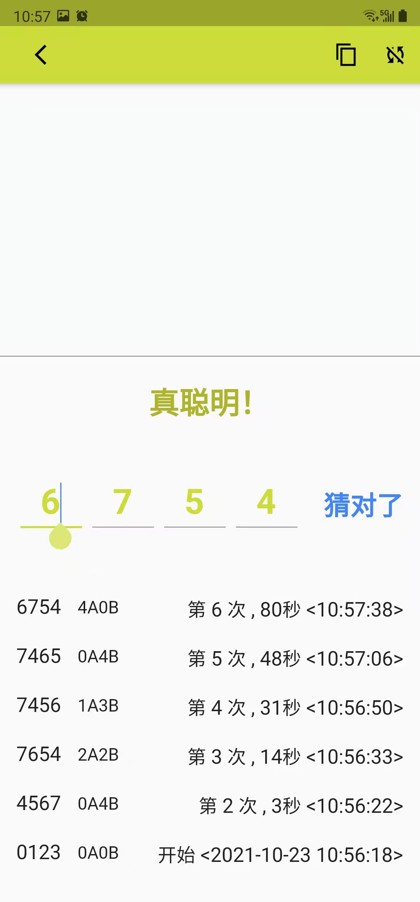

# lsnote

Simplest native note app built by Flutter, tested for Android and self used on Note20U5G and S22Ultra. 
 
 - sqlite for data storage.
 - import/export data manually(backup before remove the app), standard json format 
 - require fingerprint.

 ## Look & Feel
 
  
 
   
 
   
 
   
 
   
 
    
 
 

