# lsnote

Simplest native note app built by Flutter, tested for Android and self used on Note20U5G and
S22Ultra and S24U and S26U

- sqlite for data storage.
- import/export data manually(backup before remove the app), standard json format
- fingerprint authentication for app lock, if device support it

## Look & Feel

### APP ICON

### Landing Page without content
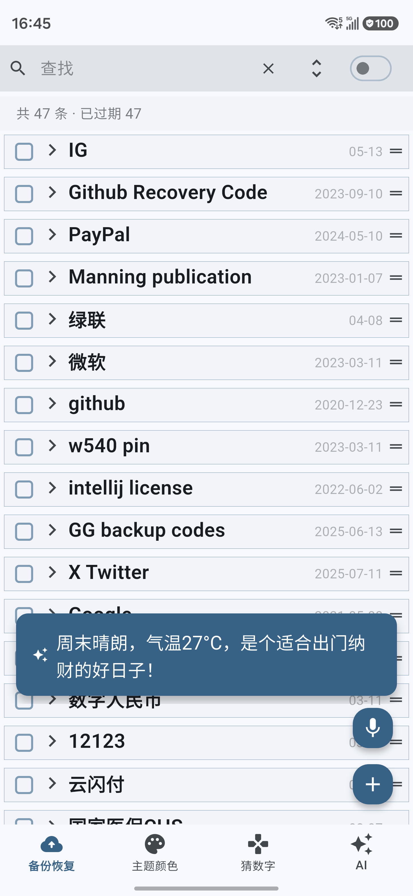

### Create New Note 
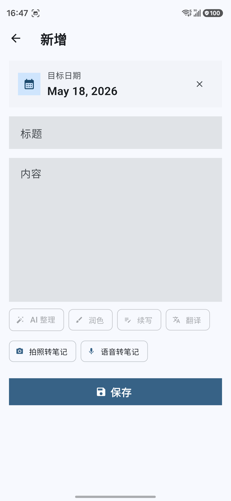

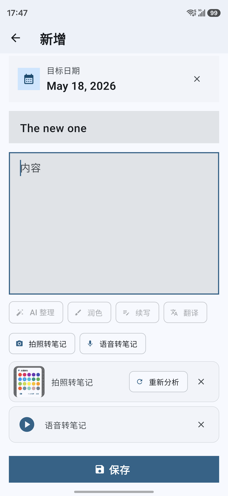

### Landing Page has content
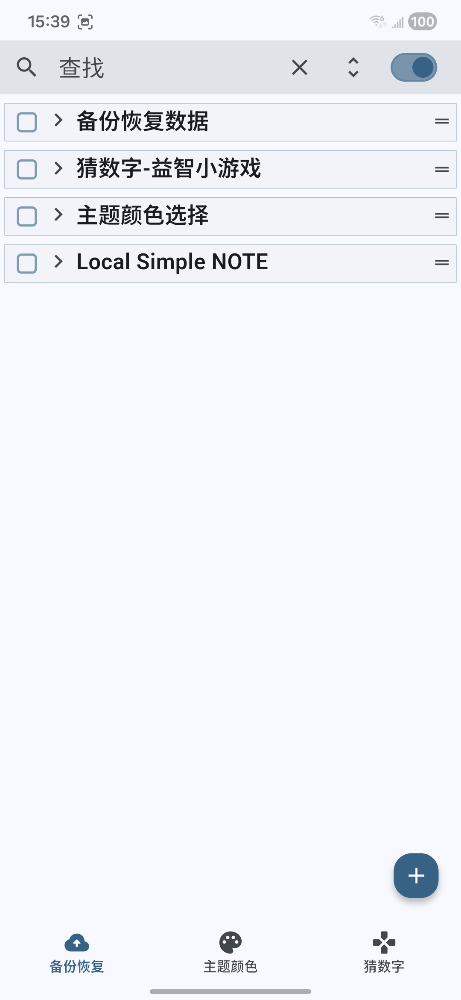

 - Drag & Drop to sort notes

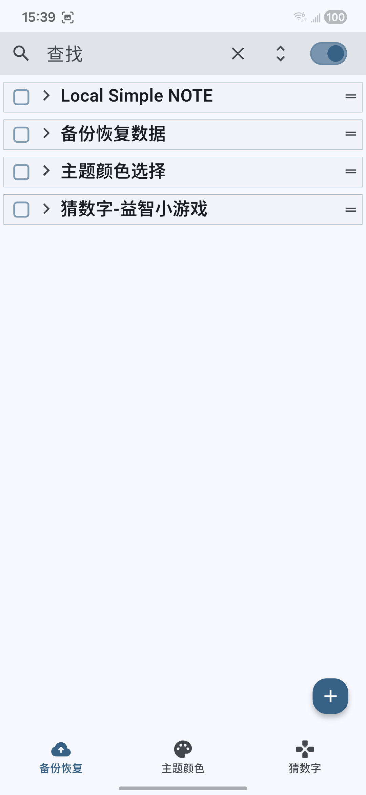
 
 - Collapse ALL notes by default

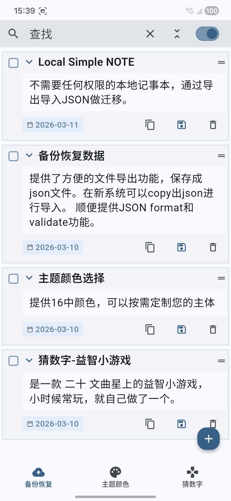

- Check to mark as DONE

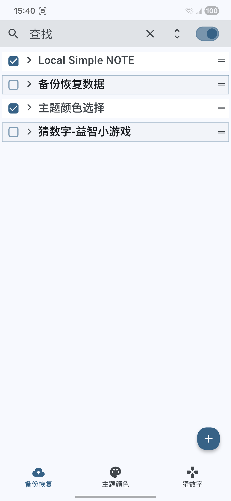

- Expand/Collapse ALL by clicking the right-top icon.

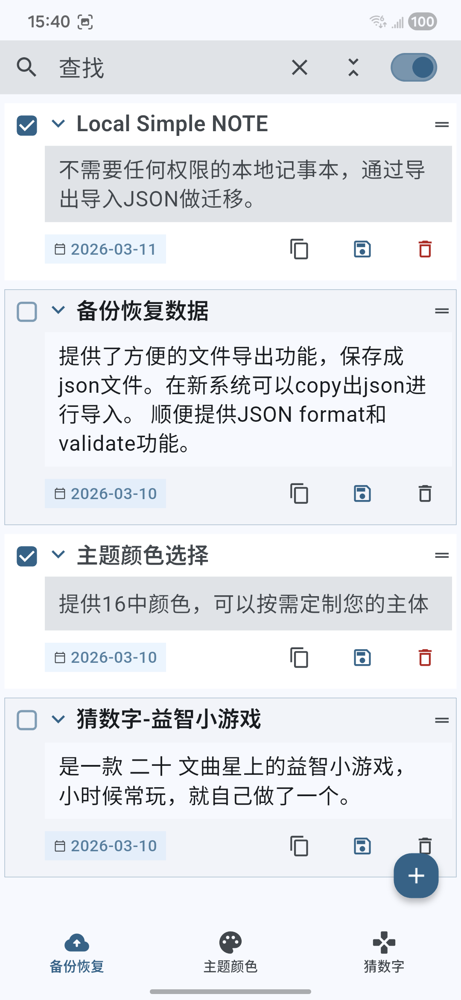

### Export/Import

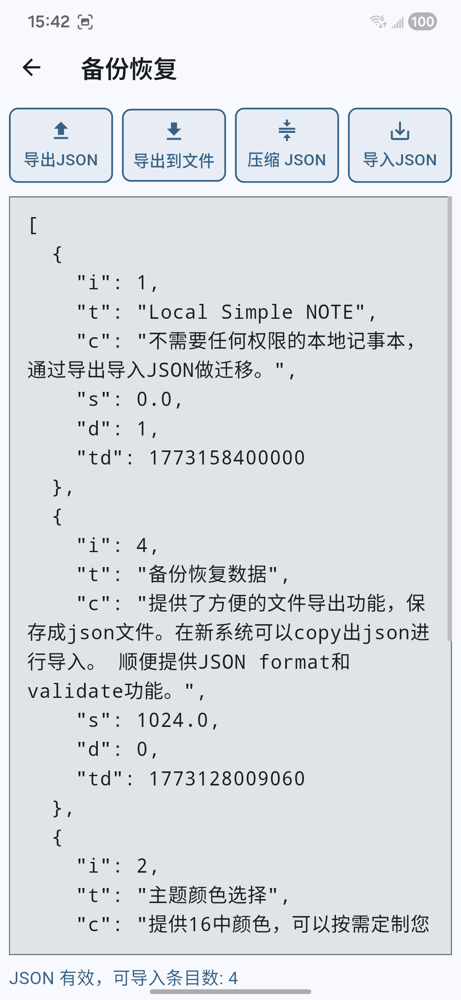

- validate/format/compress json

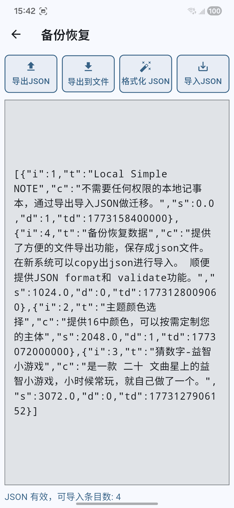

### Theme Color

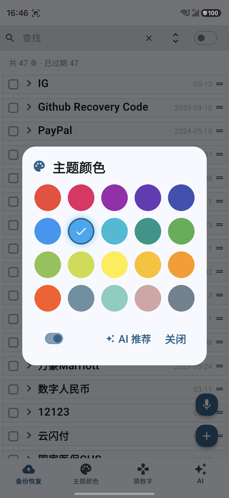

### Number Puzzle 

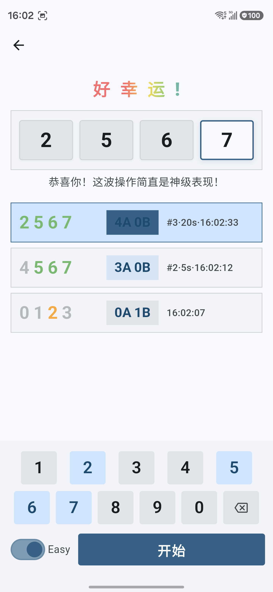

- GUESS result explanation:
    - 1A2B means 1 digit is correct and in the right position, 2 digits are correct but in the wrong position.
    - For example, if the secret number is "1234" and the guess is "1243", the result would be "2A2B" because '1' and '2' are correct and in the right position (2A), while '3' and '4' are correct but in the wrong position (2B).

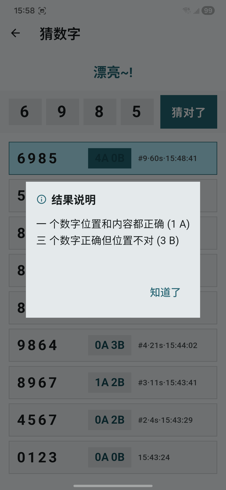

