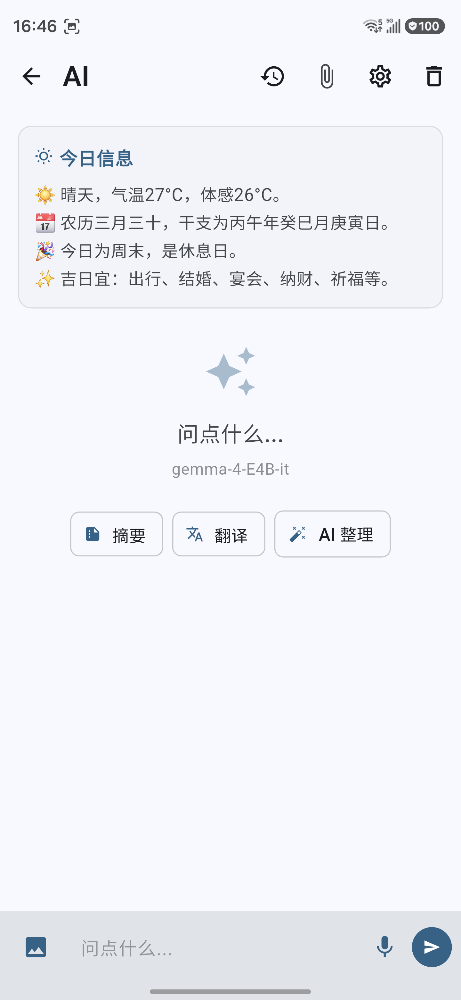
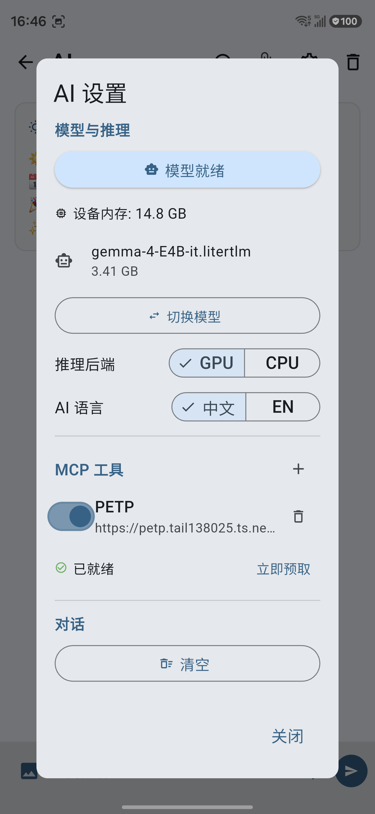

# lsnote

Simplest native note app built by Flutter, tested for Android and self used on Note20U5G and
S22Ultra and S24U and S26U

- sqlite for data storage.
- import/export data manually(backup before remove the app), standard json format
- fingerprint authentication for app lock, if device support it

## On-Device AI

Powered by **Gemma 4 E4B-it** via LiteRT-LM, all AI features run locally on-device — no network required.

### AI Chat
- Multi-turn conversation with streaming responses
- **Chat history persistence** — conversations auto-saved to SQLite sessions
- **Session management** — browse history, tap to review (read-only), swipe to delete
- **Continue conversation** — resume any past session with history injected as context
- **Quick actions (Summarize / Translate / Organize)** — always accessible above input bar; operates on input text or attached note
- **Today's info card** — vivid emoji-prefixed daily summary; long-press to copy
- Polished chat UI with refined bubble styling and typing indicators
- Markdown rendering (headings, code blocks, inline code, lists)
- Attach a note as context for Q&A
- Send images for AI analysis (vision)
- Send voice messages for AI transcription (audio)
- **Long-press AI avatar** — copy full reply or save as note directly
- **Stream throttling** — batched UI updates (~80ms) for smoother scrolling during output
- **Smart WakeLock** — screen stays on during inference, releases immediately when done
- **MCP Tool Calling** — connect to external MCP servers for real-time context (weather, calendar, earthquake info, etc.)

### MCP Integration
- **Multi-server support** — configure multiple MCP servers with individual enable/disable toggles
- Each server has name, URL, fallback URL (auto-retry on primary failure), and Bearer token
- Tool-call bubbles display `[ServerName] toolName` for easy identification
- Auto-fetches context tools (weather/holiday/time) on model load, **AI-summarized** into a concise daily info card
- Model can invoke external tools during conversation and display results inline
- Tool-calling loop with up to 5 rounds of tool use per message

### Note AI Assist
- **Organize** / **Polish** / **Continue** / **Translate** — action chips in note editor
- **Continue** appends to existing text instead of replacing it; tap repeatedly to extend long output
- **Photo to Note** — take a photo or pick from gallery, AI extracts text (in note editor)
- **Quick Voice Note** — tap the mic FAB on landing page, AI transcribes and auto-creates a new note

### Model Management
- Download and switch between multiple models (Gemma 4 E4B, E2B, Qwen3 4B, Qwen3 0.6B)
- GPU backend with automatic CPU fallback
- Device RAM detection with model recommendations
- Custom model URL support
- **Auto AI Theme** — toggle in color picker; on model load, AI picks a theme color based on weather/season/mood

### Performance & Battery
- **Stream throttling** — batched UI updates (~80ms) for smooth streaming output
- **Async native dispose** — LiteRT-LM `disposeConversation`/`disposeEngine` run on a background coroutine in the plugin layer, eliminating ANR when leaving the chat or switching sessions during inference
- **Smart WakeLock** — screen stays on only during active inference
- **Lazy list rendering** — `ReorderableListView.builder` for efficient note list scrolling
- **Listener lifecycle** — no duplicate listeners, all stream subscriptions tracked and cancelled on dispose
- **Temp file cleanup** — voice recordings deleted after transcription; note editor recordings cleaned on exit

## Look & Feel

### APP ICON

### Landing Page without content

### Create New Note 

- Optional **target date** — defaults to tomorrow, can be cleared
- Target date displayed in green (future) or gray (past) on landing page

### Landing Page has content

 - Drag & Drop to sort notes
 - Swipe right to pin/unpin notes (pinned notes stay at top)
 - Swipe left to delete (requires marking done first)

 
 - Collapse ALL notes by default

- Check to mark as DONE

- Expand/Collapse ALL by clicking the right-top icon.

### Export/Import

- validate/format/compress json

### Theme Color

### Number Puzzle 

- Custom digit pad (no system keyboard needed)
- **Easy Mode** — toggle color hints: green = correct position, orange = correct digit wrong position, gray = miss
- Animated gradient title with per-character coloring
- GUESS result explanation:
    - 1A2B means 1 digit is correct and in the right position, 2 digits are correct but in the wrong position.
    - For example, if the secret number is "1234" and the guess is "1243", the result would be "2A2B" because '1' and '2' are correct and in the right position (2A), while '3' and '4' are correct but in the wrong position (2B).

AI Chat & On device AI 

