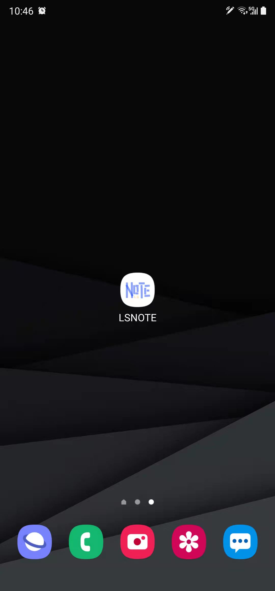

# lsnote

Simplest native note app built by Flutter, tested for Android and self used on Note20U5G and
S22Ultra and S24U and S26U

- sqlite for data storage.
- import/export data manually(backup before remove the app), standard json format
- fingerprint authentication for app lock, if device support it

## Look & Feel

 
 

